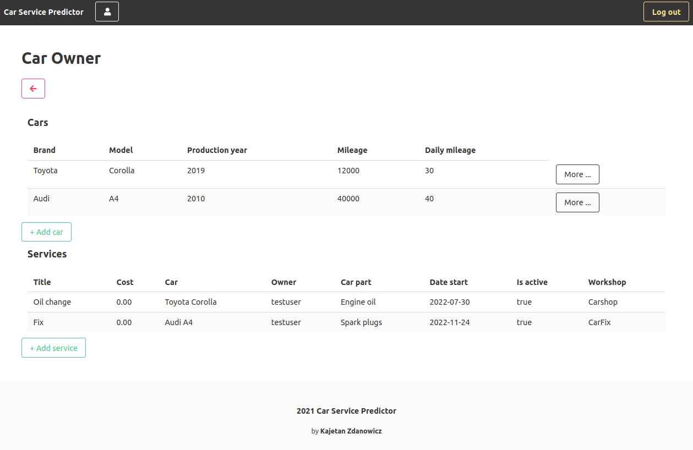

# Car service predictor

An application that will help you monitor the condition of your car and notify you of a potential need for replacement of car parts

## Run app

For the first use, copy `example.env` to `.env` file and set your own variables:

```shell
$ cp example.env .env
```

Run app:

```shell
$ docker-compose up
```

## Stop app

```shell
$ ^C
```

```shell
$ docker-compose down
```

## Technology Stack

- Backend: Django, Django Rest Framework
- Frontend: Vue.js, Bulma
- Database: PostgreSQL
- Other: Docker, Redis, Celery, Celery Beat, Prometheus, Grafana

## Usage

The application was created to support customer service in a car repair workshop. It is designed to make life easier for car and workshop owners. That is why account can be created for both purposes - monitor car's health and handle services. As a car owner, you can browse the list of workshops available in the system, add data about your car and its parts, and let the automatic memorization of periodic services or prediction of next eventual faults work for you. The owner of a repair shop is able to manage all his current services in one place. In addition, the system sends e-mail confirmations of booked or edited appointments, as well as notifications of upcoming visits.

### User profile

The first step to use the application, is to create a new account and successfully log in. The user is redirected to the start page shown below. From here, the user can go to the car or workshop owner's profile, or browse a list of all car repair shops.

<p align="center">

</p>

List of workshops includes names, address and contact information for each facility.

<p align="center">

</p>

### Car parts condition monitoring

As shown below, users can add, view and manage information about their cars and services.

<p align="center">

</p>

The car profile consists of essential data about a specific vehicle. Fields `Next fix date` and `Next fix mileage` contain information about the next suggested appointment in workshop - date and car mileage. The calculations are based on the data provided by the owner: `Fix every mileage` and `Fix every period` with knowledge of daily car's mileage. This functionality can be used especially for periodic services - such as oil or cabin filter change. The values of fields `Predicted fix date` and `Predicted fix mileage` are automatically calculated, when the system receives the information about held services for certain car model and car part. The average part durability is calculated and user is warned about additional check of that part on the specific day or mileage of the car. This functionality helps to avoid unexpected faults.

<p align="center">

</p>

### Workshop profile

The workshop owner can edit his profile or view and manage his current services. The corresponding image is shown below.

<p align="center">

</p>

### Notifications

To ensure that appointments are not forgotten, the app automatically sends emails to both parties with detailed information each time a new service is registered or updated. The car owner also receives an additional reminder on the day of the scheduled workshop visit. An example notification is shown below.

<p align="center">

</p>

### Stats

The landing page contains statistics about the objects registered in the application. It serves the curiosity about which car model is the most popular, which part is most often repaired, etc.

<p align="center">

</p>
